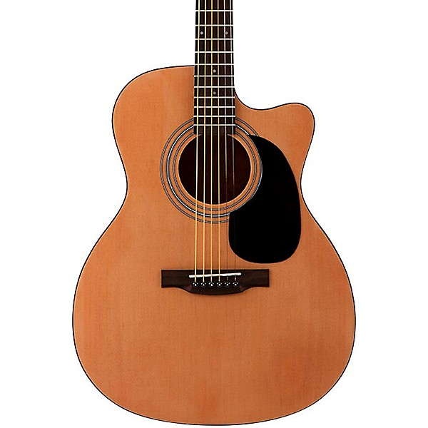

Question 1:
```{r message = FALSE, warning = FALSE}
library(haven)
library(tidyverse)
```

Question 2:
```{r}
mto_data <- read_dta("data/mto_sci_puf_cells_20130206.dta")
```


Question 3:

# This is the first level of headers

### This is the third level of headers

You can bold **like this** or __like this__

* This

* Is

* An

* Unordered

* List


1. This

2. Is

3. An

4. Ordered

5. List

image of guitar: 

Inline Code: `r 5-4`

Question 4:
```{r}
# my_variable <- 10
# my_varıable
# Error: object'my_varıable'not found
```
This code is incorrect because in the second line, the name of the variable should be "my_variable"; however, the i is replaced by a separate character: the ı or the dotless i.

Question 5:

%>% 

This pipe sign was generated using the key combination "control + shift + m"; this key combo will be very useful in advanced r programming in order to quickly generate the symbol. 
Taken from this tweet: https://twitter.com/rstudiotips/status/1295443419314049026

Question 6:

I think the circle of research hell which is hardest to avoid is post-hoc storytelling. It's easy, after collecting data and reaching a conclusion, to suffer from hindsignt bias and assume that the result was obvious from the get-go. Then, the hindsignt bias could result in the researcher writing an introduction and framing the research in such a way that gives the impression that the results were expected beforehand, thus giving into the post-hoc storytelling cicle of research hell.

Question 7:

Uploaded to github!


git push -f origin <branch>


